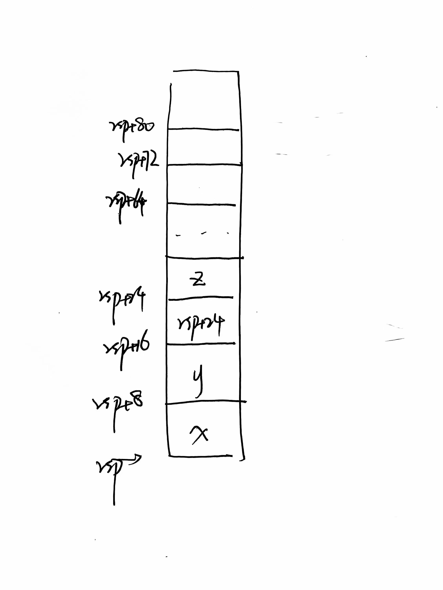
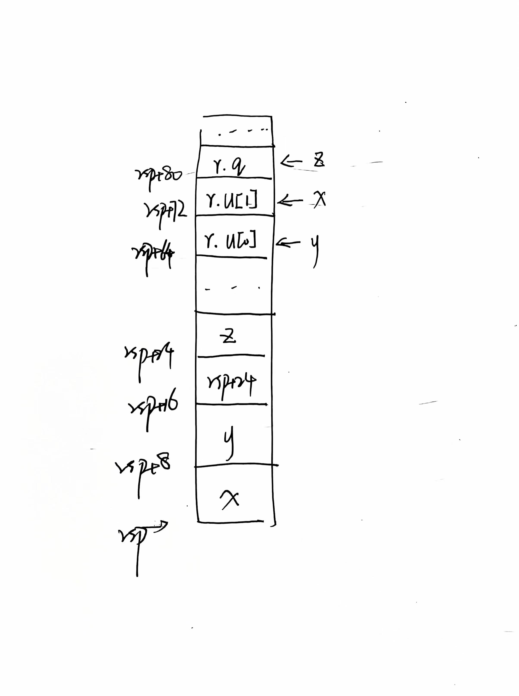

## 3.60
##### A.
|变量 |寄存器 |
|--------|------| 
|x | %rdi|;
|n | %esi|;
|result | %rax|;
|mask | %rdx|
##### B.
```C++
result = 0;
mask = 1;
```
##### C.
```C++
mask != 0; 
```
##### D.
```C++
mask <<= n%64;
```
##### E.
```C++
result |= x & mask; 
```
##### F.
```C++
long loop(long x,int n)
{
    long result = 0;
    long mask;
    for(mask = 1;mask != 0;mask <<= n%64)
    {
        result |= x & mask;
    }
    return result;
}
```

## 3.63
```C++
long switch_prob(long x,long n)
{
    long result = x;
    switch(n)
    {
        case 60:
        case 62:
            result = 8 *x;
            break;
        case 63:
            result = x;
            result >>= 3;
            break;
        case 64:
            result = x;
            result <<= 4;
            result -= x;
            x = result;
        case 65:
            x = x*x;
        case 61:
            result = x + 75;
    }
    return result;
}
```

#### 3.66

NR(n): 3*n
NC(n): 4*n+1

#### 3.67

A.

B.
传递了 rsp+64 的地址
C.
通过 栈寄存器+偏移量 访问
D.
更改以 rsp+64 为起始地址的一部分栈
E.

F.
只用传递该结构在栈上的起始地址，被调用的函数对栈进行修改即可

#### 3.68

4 < B <= 8
6 < A <= 10
44 < A*B <= 46
 
解得：A = 9, B = 5