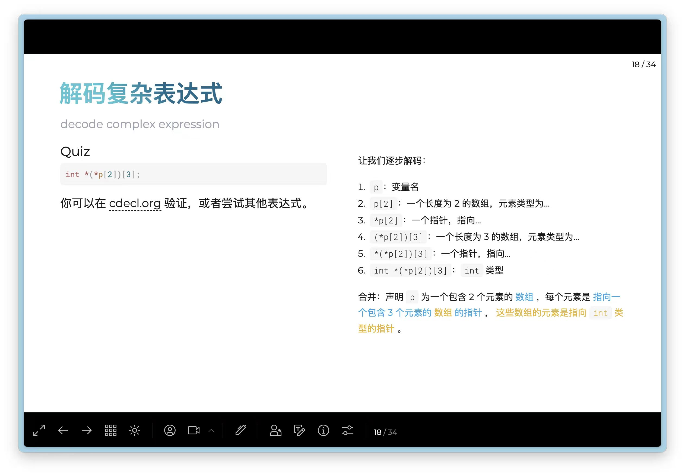
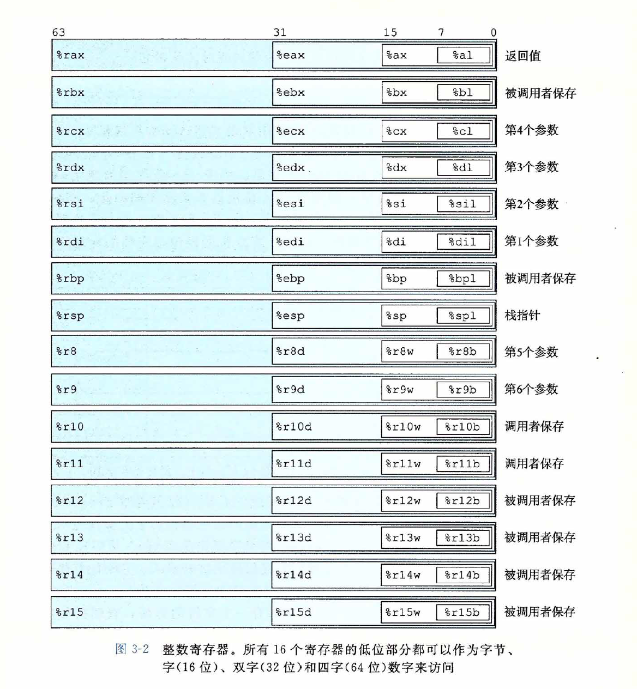
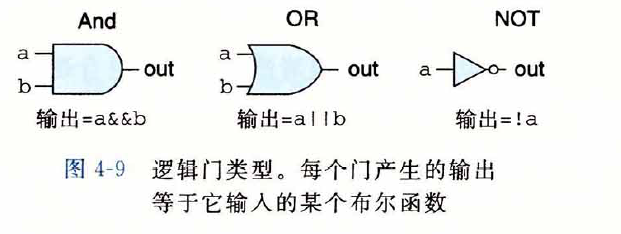

# 数据：
##### 1.
```
short -> unsigned int
<=> (unsigned)(int)
```
即先转为int再转为unsigned

##### 2.
sizeof()返回的是unsigned类型

#### 3.
unsigned $>$ int $>$ short 

#### 4. 
用除法判断乘法溢出时要先注意被除数不为0

#### 5. 
NaN 和任何数（包括自己）比较都为false
NaN 与任何数运算都是NaN
$+\infty - +\infty=$ NaN
$x/0=$ NaN

#### 6.
整数除法默认向0舍入
右移运算后得到的结果为向下舍入，加入bias=(1<< k)-1后就可以向0舍入
浮点运算出现精度问题后向偶数舍入

#### 7.
浮点运算不满足结合律，分配律
满足单调属性，即对$x\neq$NaN，都有$a\geq b \leftrightarrow a+x\geq b+x$
对$a\neq$NaN，都有$a * a\geq 0$

# 汇编语言：
#### 1.

cmov指令的src和des只能为16/32/64位寄存器，不支持单字节传送

#### 2.

Union大小至少为最大成员的大小，若此时不满足对齐规则，会自动对齐
[blog](https://blog.csdn.net/Hush_H/article/details/127169690?ops_request_misc=%257B%2522request%255Fid%2522%253A%2522C4091729-D650-49CA-94DC-879E57542071%2522%252C%2522scm%2522%253A%252220140713.130102334.pc%255Fall.%2522%257D&request_id=C4091729-D650-49CA-94DC-879E57542071&biz_id=0&utm_medium=distribute.pc_search_result.none-task-blog-2~all~first_rank_ecpm_v1~rank_v31_ecpm-6-127169690-null-null.142^v100^pc_search_result_base5&utm_term=union%E5%A4%A7%E5%B0%8F%E8%AE%A1%E7%AE%97&spm=1018.2226.3001.4187)
计算struct大小时注意对齐规则，也要考虑struct数组时的对齐

#### 3.
解码复杂表达式



#### 4.
寄存器



#### 5.
movabsq 只支持寄存器作为目的操作数，传送绝对的四字。
movq 传送符号扩展的四字

# 体系结构：
#### 1.
与门底是平的，或门底是尖的

